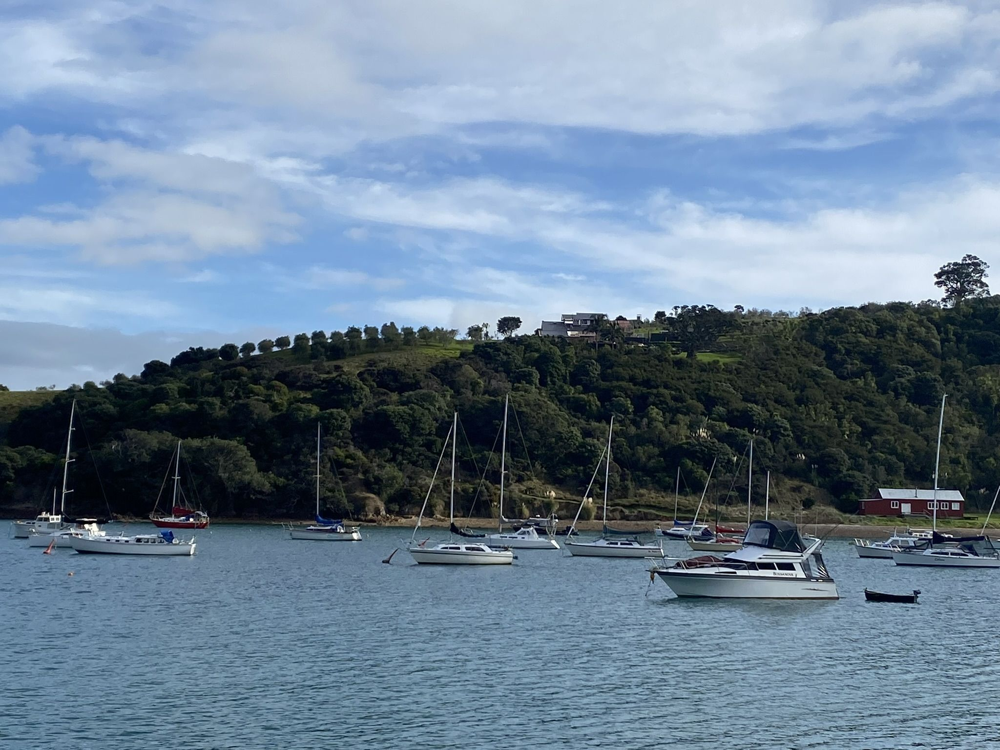

This page contains a collection of markdown entities to demo/test their rendering.

## Admonitions

<!-- markdownlint-disable MD028 -->

> [!NOTE]
> Useful information that users should know, even when skimming content.
> This also has an amount of content which will need to spill onto a new line.

> [!TIP]
> Helpful advice for doing things better or more easily.

> [!INFO]
> Key information users need to know to achieve their goal.

> [!WARNING]
> Urgent info that needs immediate user attention to avoid problems.

> [!DANGER]
> Advises about risks or negative outcomes of certain actions.

> [!NOTE] Custom Title
> This is a note with a custom title.

> [!NOTE]- Expandable Note
> This is a collapsible note.
> It starts collapsed.

> [!NOTE]+ Collapsible Note
> This is a collapsible note.
> It starts expanded.

<!-- markdownlint-enable MD028 -->

## Maps











## Term

The term  and  in some text.

[The term  in a link](https://thega.me.uk/)

## Gallery







<!-- markdownlint-disable MD059 -->

<!-- markdownlint-enable MD059 -->

## Image Width

Full width image:



Half width image:


{style="width:50%;"}

## Code Blocks

```html {title="code_with_title_and_highlight.html" lineNos=inline hl_lines=[4,"7-9"]}
<!DOCTYPE html>
<html lang="en">
<head>
  <meta charset="utf-8">
  <title>Example HTML5 Document</title>
</head>
<body>
  <p>Test</p>
</body>
</html>
```
