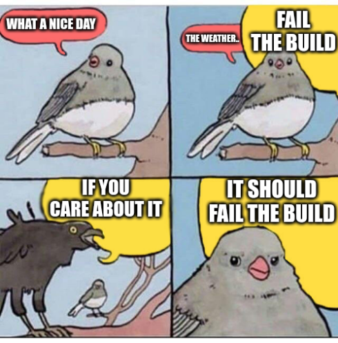

---
aliases:
  - "/code/rule-one/"
title: "One Rule to Build Them All"
date: 2024-05-25 18:56:00 +0000
categories: [code]
tags: ["code quality"]
summary: "If you care about it, make it fail the build."
---

Every business is different, every codebase has debt that needs to be worked around.
Any given project has different success criteria (budget vs. cost vs. scope).

Whenever I read an engineering blog, there is normally some law or rule on offer which I have to carefully evaluate against the codebase I am responsible for.

There is however one rule which I will always follow on any project I work on:

> **_If it doesn't break your CI/CD pipeline, you don't care about it_**

Or alternatively:

> If you care about `something`, make `something` fail the build

This 'rule' makes a key assumption; You are running some form of CI/CD (the build) which can fail or pass.
That, and the build pipeline should be a gate that [stops a PR being merged](https://docs.github.com/en/pull-requests/collaborating-with-pull-requests/collaborating-on-repositories-with-code-quality-features/about-status-checks) and the given changes being released to production if it fails.

The most obvious example is your project's automated tests (because you have tests right?):

> If you care about `unit tests`, make `unit tests` fail the build

If those tests don't fail your build, you can release with failing tests.
If you have failing tests then you have broken features.
And if you have broken features in production, then you didn't care about it because you didn't make the check fail the build.

This same logic works for many other tools an engineer can use:

- Static Code Analysis (e.g. [PMD](https://pmd.github.io/))
- Secret Scanning (e.g. [trufflehog](https://github.com/trufflesecurity/trufflehog))
- Code Style (e.g. [spotless](https://github.com/diffplug/spotless))
- ...

If someone commits a file indented with Tabs and not Spaces and your code style mandates Spaces, that commit should not be able to get onto `main` without something failing somewhere.

If someone commits code which introduces a SQL injection vulnerability (which [SAST](https://en.wikipedia.org/wiki/Static_application_security_testing) tools can detect) and you don't prevent that commit from getting to production, then you don't care about SQL injection.

Importantly, any of these _normally_ blocking checks must be able to be bypassed for any given reason.
More importantly, any exclusion **must** be codified:

```diff
commit 091c52859f38a4bb6e1448f68e46ce75a765c639 (HEAD -> main)
Author: Phillip Whittlesea-Clark <pw.github@thega.me.uk>
Date:   Fri May 10 20:30:06 2024 +0100

    Adding skipTests as its 4am and I need to fix this production incident

diff --git a/build.sh b/build.sh
index ce747d2..04a9f1f 100644
--- a/build.sh
+++ b/build.sh
@@ -4,4 +4,4 @@ set +e

 SCRIPT_DIR=$( cd -- "$( dirname -- "${BASH_SOURCE[0]}" )" &> /dev/null && pwd )

-mvn clean install
+mvn clean install -DskipTests
```

Whether it's an [annotation](https://pmd.github.io/pmd/pmd_userdocs_suppressing_warnings.html), an [ignores file](https://spotbugs.readthedocs.io/en/stable/filter.html#examples), or a change to a build file, you should have a record of who and why the rule was ignored.

I spend most of my days working on Java codebases built using Maven; here is my current selection of plugins which fail the build:

- **[Maven Enforcer Plugin](https://github.com/apache/maven-enforcer)** stops the build from including JUnit, Mockito (and other common test libraries) at compile scope.
- **[Spotless](https://github.com/diffplug/spotless)** enforces formatting of all Java files using the [palantir](https://github.com/palantir/palantir-java-format) code formatter.
- **[Checkstyle](https://checkstyle.sourceforge.io/)** checks that documentation on classes/methods/fields exists (and my favourite check, [AvoidStartImport](https://checkstyle.sourceforge.io/checks/imports/avoidstarimport.html)).
- **[PMD](https://pmd.github.io/)** checks for programmer mistakes like missing breaks in switch statements.
- **[SpotBugs](https://spotbugs.github.io/)** uses static analysis to look for bugs in Java code.
- **[JaCoCo](https://www.jacoco.org/jacoco/)** tracks coverage data and will fail the build if line coverage is less than 85%.
- **[Find-Sec-Bugs](http://find-sec-bugs.github.io/)** is an extension to SpotBugs which checks for security vulnerabilities.
- **[Old GroupIds Alerter](https://github.com/jonathanlermitage/oga-maven-plugin)** catches the use of dependencies which have been relocated to another Maven Group/Artifact.



Tldr; If you care about it, make it fail the build.
