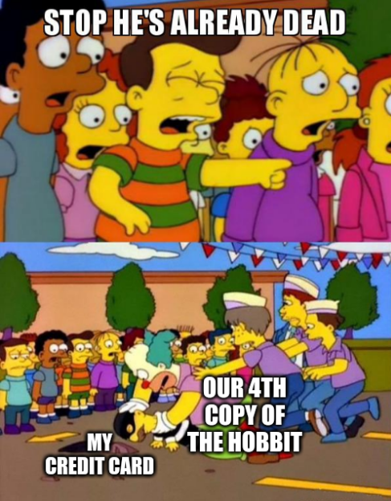

---
aliases:
  - "/holidays/new-zealand-5/"
title: "I visited New Zealand - Part 5"
date: 2024-10-21 22:43:00 +0100
categories: [holidays]
tags : ["new zealand"]
series: ["New Zealand"]
series_order: 5

summary: "We spent 4 nights in Wellington, made 3 trips to Wētā, ate at 2 Restaurants, and visited 1 Museum"

maps:
  - name: new-zealand-5
    points:
      - lat: -41.291761454471406
        lon: 174.78748114376063
      - name: Mt. Victoria
        lat: -41.301184010394486
        lon: 174.78839327088363
      - name: Wētā Workshop
        lat: -41.30618454026299
        lon: 174.82436135230336
      - name: The Roxy Cinema
        lat: -41.3158010293963
        lon: 174.81627597873947
      - name: Te Papa
        lat: -41.29089173040525
        lon: 174.78200315539732
      - lat: -41.291761454471406
        lon: 174.78748114376063

off-road-nazgul:
  - url: new_zealand_1258-full.jpeg
    image_path: new_zealand_1258-full.jpeg

off-road-tree:
  - url: new_zealand_1275-full.jpeg
    image_path: new_zealand_1275-full.jpeg

off-road:
  - url: new_zealand_1304.jpeg
    image_path: new_zealand_1304.jpeg
    title: "A view over Wellington from Mount Victoria"

weta-cave:
  - url: new_zealand_1316.jpeg
    image_path: new_zealand_1316.jpeg
    title: "Even the Trolls were celebrating"
  - url: new_zealand_1330.jpeg
    image_path: new_zealand_1330.jpeg
    title: "Lurtz looks positively festive"
  - url: new_zealand_1331.jpeg
    image_path: new_zealand_1331.jpeg
    title: "If there was a head, it had a birthday hat"

weta-take-2:
  - url: new_zealand_0917.jpeg
    image_path: new_zealand_0917.jpeg
    title: "My other half trying on a helmet"
  - url: new_zealand_1399.jpeg
    image_path: new_zealand_1399.jpeg
    title: "Two models showing different stages of contruction"
  - url: new_zealand_1400.jpeg
    image_path: new_zealand_1400.jpeg
    title: "A model of the Balrog"

te-papa:
  - url: new_zealand_1417.jpeg
    image_path: new_zealand_1417.jpeg
    title: "The first room of the exhibit"
  - url: new_zealand_1427.jpeg
    image_path: new_zealand_1427.jpeg
    title: "The machine gun trio"
  - url: new_zealand_1428.jpeg
    image_path: new_zealand_1428.jpeg
    title: "Another angle of the machine gun trio"
---

In part 4, we arrived in Wellington.
It was the end of the day, so we only managed to get out for a spot of dinner.
But, we are set to stay in Wellington for 4 nights, so there's lots left to see.



## Saturday 8^th^: Getting Wētā Again

Before we arrived the day before, it was predicted that the weather on Monday was going to be horrible, so our tour guide spent a bit of time re-arranging our agenda.
Instead of going to the Wellington filming locations on Monday, we were going to squeeze them into Saturday.

It was going to be a busy day!

### Off Road

Our time with _Shadowfax_ &mdash; our coach &mdash; was limited, and before long we would be waving goodbye to him.
But that time had not yet come, and we all climbed back aboard for a full day of looking at things (maybe pointing at things too).

Wellington is a pretty large city which is heavily populated, and I don't remember any high-rise blocks of flats in , so I was wondering where on earth the film locations would be.

Mount Victoria sits in the middle of the city, and that was our destination.
_Shadowfax_ expertly navigated the winding roads leading up the mountain.
About halfway up, we stopped to head into the forest.

Very close to one another were two different filming locations from the first film.
The first being where the hobbits hide under some tree roots as a ring wraith searches for them.



The tree they are hiding under was a prop created by the team at Wētā and was removed after filming.
Out picture isn't quite the same angle, so you might have to trust me on that one :smile:.

Then, literally down the hill about 20 meters, was the tree Sam and Frodo stop to take a break in.



We had an immense amount of fun with the tour group, recreating each of the scenes.
At one point I got to play the part of the Nazgul's horse, horse mask and all.

When we were done we carried on up to the viewing platform at the top of Mount Victoria, giving us 360 degree views of Wellington.



★★★★☆ 4/5 - Mount Victoria was beautiful and a must-see!
I would recommend a visit if you like walking (and even if you don't).

### Wētā Cave

After our early morning visit to the mountain, we headed down to the Wellington [Wētā Cave](https://tours.wetaworkshop.com/wetacave/) &mdash; Wētā's retail store &mdash; for a bit of retail therapy.

If you read my [second blog on New Zealand](#weta-workshop-unleashed), then you will remember we went to a Wētā cave in Auckland.

The Wellington 'cave' (store) was an experience of its own.
Existing somewhere between a museum and a store, we were able to browse costumes from the LoTR films _and_ buy miniatures/collectibles (like [this adorable cave troll](https://www.wetanz.com/nz/mini-epics-cave-troll)).

We had managed to arrive at the cave on its 16^th^ birthday.
Every surface was adorned with bunting while all the statues sported party hats.



My other half was the driver for us coming to New Zealand, to do a LoTR tour, as the films were transformational for them when they were younger.
They also love 'The Hobbit' book and owned 3 copies from various prints.

Unfortunately for our bank account, there was a limited edition, illustrated copy of 'The Hobbit' in the Wētā cave.
I was reliably informed that this edition had to come home with us.

★★★★☆ 4/5 - If you want LoTR goodies, this shop is the place for you (but maybe not your bank manager).
It is basically the same as the one in Auckland, however, so if you have been there don't go out of your way to this one (unless you are doing a tour).

### The Roxy Cinema

As we were trying to squeeze our Monday itinerary into today, we headed off for lunch at [The Roxy Cinema](https://www.roxycinema.co.nz/).

This beautiful Art Deco cinema was restored about a decade ago, with much of the interior designed and built by Wētā.

Movie posters adorned the walls, whilst a giant mural of a robot invasion sprawled across the ceiling.
Somehow tastefully in-line with the Arc Deco vibe.

The upper floor of the lobby contained a 'museum' of sorts; random movie related figures, props and memorabilia dotted everywhere.

The coolest thing I found was a Lego reproduction of the Cinema that was squirrelled away in the corner.

I also remember a life-size Astro boy, but no-one else does, so I might have been hallucinating.

It was a very fun space, and we got about 20 minutes to wander around after we had eaten a 'nibbly-bits' style lunch; several plates of single-bite food like scotch eggs and roast potatoes.

★★★☆☆ 3/5[^1] - Interesting cinema and the food was OK.

[^1]: I feel bad giving this only a 3 because it was a beautiful space, but compared to everything else on the holiday, this was one of the less 'mind-blowing' experiences.

### Wētā Workshop {#weta-workshop}

Back to Wētā we went.
This time we were going to Wētā Workshop, which was about 2 doors down from the Wētā cave we were at not hours before.

The 'Unleashed' tour in Auckland showcased the process behind making a generic fantasy film; from concept, all the way up to making the 'Bigatures' you see on screen in films like LoTR.

The 'Workshop' tour, however, took us through a Wētā costume museum; filled with armour, guns, and prosthetics from many of the films they had worked on.
We took about an hour wandering slowly around, guided one of the Wētā team.
We touched fake noses, held replica laser rifles, and marvelled at the attention to detail on chain mail armour.

When we were done (and we had run out of questions) we had a hands-on workshop where we designed and dyed a leather keyring.

Proud of the basic leather work we had done, we headed back to the hotel.

★★★★★ 5/5 - Our Wētā tour guide had a genuine joy that was infectious and turned a run-of-the-mill museum tour into a unique experience I thoroughly enjoyed.

### Crab Shack

The only thing left for us to do was to find somewhere to eat.

We had heard that Wellington was famous for fantastic seafood.

Teaming up with two of our tour-besties &mdash; the same pair we [went to dinner](#atticus-finch) with before &mdash; we headed down to [The Crab Shack](https://www.crabshack.co.nz/book/the-crab-shack-wellington/).

It was a beautiful night[^2], the company was great, and the food delicious.
My other half had a whole crab, which I was very jealous of.

[^2]: Unbeknownst to us, this turned out to be the last night of the holiday that wasn't either freezing cold, or tipping it down with rain.

★★★★☆ 4/5 - Very quick service and good food.

## Sunday 9^th^: Talks in the Hotel

Sunday is the day for rest.

Or in our case, the day for rain.

It was _hammering_ it down.
Outside the hotel it was hard to tell where the bay ended and the streets started.
I was therefore glad that we didn't need to leave the hotel.

### Private Talks

The plan for the day was to attend two talks organised by our tour guides; Red Carpet Tours.

The first talk was by [Daniel Reeve](https://danielreeve.co.nz/).
Daniel was responsible for almost all the calligraphy and maps featured in the LoTR films; having to invent new writing styles for all the cultures of Middle Earth.

Daniel was a software engineer who decided to mail Peter Jackson some elvish calligraphy when he heard they were making the LoTR films, completely changing his career path (and life) in the process.

It was a very engaging talk and I had never been so interested in calligraphy before.
If I was to take one thing away, it's that sometimes you have to take chances; it could change your life for the better.

The second talk was by [Christopher Menges](https://www.instagram.com/christophermenges/), a senior swordsmith at Wētā.
Chris brought a lot of movie-used props with him for the day and talked about the art of making swords for films.

I'm pretty surprised he didn't need an armed escort; some of those swords had to be worth a fair amount.

We got to see the 'hero swords' &mdash; the swords used for all the close up shots with the actor &mdash; as well as the prop swords, allowing us to compare the two.

It was another fun and engaging talk on a topic that I hadn't put much thought to.

### Sweet Mother's Kitchen

All talked out, and noticing the rain had stopped, we grabbed a quiet dinner at [Sweet Mother's Kitchen](https://sweetmotherskitchen.co.nz/).

I remember the basket of buttermilk chicken and fries that I ordered hitting the spot.
But more than that I remember the fun and endlessly distracting decorations.

Strings of Polaroids hung from the ceiling.
Photos, newspaper clippings, money from all corners of the planet, and customers artwork was pinned haphazardly to the wall; filling every available space.

★★★★☆ 4/5 - A fun restaurant with reasonably priced, good food.

## Monday 10^th^: Sponsored by Wētā

Today was the day when the heavens were set to open.

As all our planned activities had been cleared out, we were clear to pick whatever we wanted to do.
Given the lack of clear skies, it had to be something indoors.

We had been invited by a couple on our tour to go back to Wētā to do their 'normal' tour for regular tourists.

With no better ideas of our own, off we went.

### Another Wētā tour

There was always the risk that the [Wētā Workshop Experience](https://tours.wetaworkshop.com/wellington/tours/weta-workshop-experience/) was going to cover a lot of the content we had previously seen in the two ([1](#weta-workshop-unleashed), [2](#weta-workshop)) previous tours.

The group for this tour was much smaller than the other ones.
There were about 7 of us, so we were able to ask _way_ more questions about each thing we were shown.

The tour is more 'Wētā' focused than the others we had been on; which had been more LoTR focused.

As a lover of sci-fi, what I didn't realise is how many of the films I had watched were powered by Wētā.

Some pretty famous films like [Dune: Part 2](https://www.imdb.com/title/tt15239678/), [The Wandering Earth](https://www.imdb.com/title/tt7605074/), and [Cocaine Bear](https://www.imdb.com/title/tt14209916/).

Some less well known films as [Spectral](https://www.imdb.com/title/tt2106651/), [The Great Wall](https://www.imdb.com/title/tt2034800/), and [I Am Mother](https://www.imdb.com/title/tt6292852/).

And also, unfortunately, the complete dumpster fire which was [Rebel Moon](https://www.imdb.com/title/tt14998742/)[^3].

[^3]: I could write a whole blog on how Rebel Moon is garbage.

We were treated to a pretty fun video explaining how prosthetics are made for actors.
Fun fact: It's illegal to sell the mold for a dead actor (which makes total sense), but you _can_ swap them; making them the creepiest Pokémon cards you can trade.

The next room had every wall covered in (maybe original) suits from many of the films Wētā had worked on; Power Rangers, I Am Mother, and District 9 to name a few.

From this room you could see inside the actual sword smithing workshop, where Sam (from the talks the day before) was working, which was very cool.

Then we moved through the penultimate room; floor to ceiling shelves filled with props, models and artwork.
However, unlike every other space in Wētā, we were allowed to pick up and 'play' with these.



The final room was a creative space where the tour guide walked us through 'model making 101'; they even asked us to create little tin foil models of our own.

One of my takeaways from this tour, over the others, was the sense that 'maybe I _could_ be creative'.
Maybe I could _make_ things.

Like I haven't.
But I _could_.

Overall I think this tour was my favourite of the three we did (spoiler, this is the last one).
I'm a fan of the LoTR, and I enjoyed the Auckland 'unleashed' experience, but this more personal tour really shone above the others.

★★★★★ 5/5 - Inspiring, fun and informative. Well worth it!

### Te Papa

The tour took up about half of our day.
This was our last day in Wellington, and we knew that the [Te Papa](https://www.tepapa.govt.nz/) museum came highly recommended.

The museum is huge, far larger than someone could visit in a single day.
Unable to escape Wētā Workshop, we went to the _Gallipoli: The Scale of Our War_ exhibit, where larger than life recreations &mdash; created by Wētā &mdash; help tell eight individuals stories from the war.

Each figure was 2.4 times human size, and words do not describe how lifelike they look.



Standing in the room with these figures was actually unnerving as I felt like I was just staring at a person frozen in time.
Some deep part of my brain was telling me I was looking into the eyes of a real person.

Afterwards we toured the _Te Taiao_ (Nature) exhibit and saw the biggest colossal squid ever caught.
Followed by the _Rongomaraeroa_: a 'living' exhibition that showcased contemporary Māori art and design.
And finally the _Treaty of Waitangi: Signs of a Nation_ which was very educational on how the Treaty shaped relationships between the peoples of New Zealand.

All in all, we spent about 4 hours in the museum and by the time we left, the sun had set.
Thus rounding out our day and our time in Wellington.

★★★★☆ 4/5 - If you're like me and love a museum this is a solid must for a rainy day.

## Tuesday 11^th^: The South Island

That wraps up the North Island of New Zealand.

I was pretty sad to leave Wellington.
It seemed like a cool place and being the middle-aged man I am, once again I looked at house prices.

Once again I decided that I was too poor to live there.

Next time we will be flying down South to Queenstown.

Kia Ora!
See you in [part 6]()!
