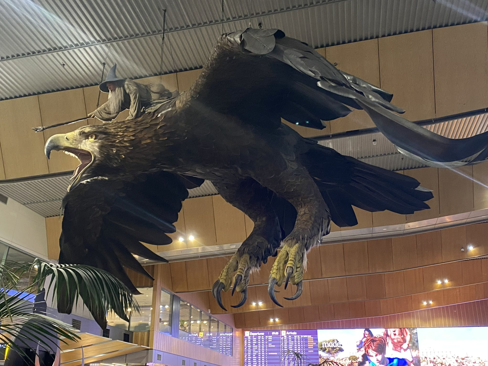

---
aliases:
  - "/holidays/new-zealand-6/"
title: "I visited New Zealand - Part 6"
date: 2025-01-11 10:39:00 +0000
last_modified_at: 2025-04-27 12:49:52 +0100
categories: [holidays]
tags : ["new zealand"]
series: ["New Zealand"]
series_order: 6

summary: "We travel to the southern island to discover a different country"

maps:
  - name: wellington-to-queenstown
    line: true
    points:
      - name: Wellington
        lat: -41.291761454471406
        lon: 174.78748114376063
      - name: Queenstown
        lat: -45.03347057750902
        lon: 168.66279045647295
  - name: queenstown-airport-to-hotel
    points:
      - name: Queenstown Airport
        lat: -45.019360787712515
        lon: 168.74526787099077
      - name: AJ Hackett
        lat: -45.00948328205435
        lon: 168.90014779383964
      - name: Our Hotel
        lat: -45.03347057750902
        lon: 168.66279045647295
  - name: off-road
    points:
      - name: Our Hotel
        lat: -45.03347057750902
        lon: 168.66279045647295
      - name: Garston Hunny
        lat: -45.46427590829946
        lon: 168.68407101736008
      - name: Mavora Lakes
        lat: -45.26739420395245
        lon: 168.17344976743658

queenstown-airport:
  - url: new_zealand_1470.jpeg
    image_path: new_zealand_1470.jpeg
    title: "Our first view of the southern island from the coach"

kawarau:
  - url: new_zealand_1473.jpeg
    image_path: new_zealand_1473.jpeg
    title: "I've never seen a river so naturally blue"
  - url: new_zealand_1474.jpeg
    image_path: new_zealand_1474.jpeg
    title: "The bungy jump from the bridge"
  - url: 3d3b4eb7-7303-4efb-8a2d-a303eff51565.jpg
    image_path: 3d3b4eb7-7303-4efb-8a2d-a303eff51565.jpg
    title: "A blurry picture of us zip lining"

queenstown:
  - url: new_zealand_1487.jpeg
    image_path: new_zealand_1487.jpeg
    title: "A view out over the bay at Queenstown"
  - url: new_zealand_1489.jpeg
    image_path: new_zealand_1489.jpeg
    title: "The same bay at Queenstown at night"

off-road-uruk-hai:
  - url: new_zealand_1519-full.jpeg
    image_path: new_zealand_1519-full.jpeg

off-road-gandalf:
  - url: new_zealand_1679-full.jpeg
    image_path: new_zealand_1679-full.jpeg

off-road-fangorn-forest:
  - url: new_zealand_1538-full.jpeg
    image_path: new_zealand_1538-full.jpeg

off-road-anduin-river:
  - url: new_zealand_1575-full.jpeg
    image_path: new_zealand_1575-full.jpeg

off-road-anduin:
  - url: new_zealand_1565.jpeg
    image_path: new_zealand_1565.jpeg
    title: "The mountain range in the distance was astounding"
  - url: new_zealand_1587.jpeg
    image_path: new_zealand_1587.jpeg
    title: "The canopy at the Mararoa River"
  - url: new_zealand_1571.jpeg
    image_path: new_zealand_1571.jpeg
    title: "The bridge over the Mararoa River"

off-road-nen-hithoel-beach:
  - url: new_zealand_1052-full.jpeg
    image_path: new_zealand_1052-full.jpeg

off-road-nen-hithoel-tree:
  - url: new_zealand_0940-full.jpeg
    image_path: new_zealand_0940-full.jpeg

off-road-nen-hithoel-log:
  - url: new_zealand_1636-full.jpeg
    image_path: new_zealand_1636-full.jpeg
---

> [!NOTE] Happy New Year!
>
> It's been a while since my last post, and it's been over six months since I got back from New Zealand.
> I really need to hurry up.

At the end of [part 5]() we had just finished 4 nights in Wellington.
It was now time for us to depart to New Zealand's southern island.

On the northern island we had done lots of tours, talks, and had visited the most LoTR thing in New Zealand - Hobbiton.
We had dotted between some of the north's major cities, witnessing a slice of New Zealand's culture along the way.

And we had seen plenty of Wētā Workshop.
Maybe too much?
Nah.

The tour of southern island was set to be far more 'outdoorsy'; focusing on the natural beauty of New Zealand.

## Tuesday 11^th^: The South Island



I remember Tuesday the 11^th^ because it's the day of the holiday I woke up at 3am, sat bolt upright in bed, realising that the name I booked the tour under was not the same as the name on my passport[^1].

[^1]: I am holding on to my EU burgundy passport until the day it expires.

Why was this important enough to stir me from my sleep?
Well the tour company had booked the flight from Wellington to Queenstown for us, and they had probably used the name on the tour, not the name I was currently legally known as.

It's not normally a problem because all I have done is hyphenate mine and my partners 'maiden' names, which most people are fine with:

`Whittlesea` + `Clark` = `Whittlesea-Clark`

However, airlines and immigration officials are not normally as accommodating when it comes to paperwork irregularities.
I sat and worried about that until breakfast where I expressed my concern to our tour guide.

"You don't need ID to travel between the northern and southern islands" she said.

My mind was blown.
In the UK, there is no way you would be able to get on a domestic flight without showing some form of ID that matched the name on the ticket.

Crisis resolved, I finished breakfast feeling much better.
We hauled our luggage outside and climbed back onto Shadowfax &mdash; the name we had given our coach &mdash; for one final ride to the airport.

Wellington airport is known for having fun  decorations.
Unfortunately the [giant Gollum](https://www.nzherald.co.nz/nz/giant-gollum-gobbles-wellington-airport/5NXTP2N7PJPIUWBYZZ2CJCET4E/) had to go after an earthquake, but we were still left with Gandalf riding an eagle.

{style="width: 50%;"}

This was the last Wētā Workshop created thing we saw whilst we were on holiday.

The Air New Zealand short haul flight passed without note, our 24 hours of flying to get to New Zealand had altered what our idea of a long flight was.
Honestly, this one felt like it was over before it had gotten started.
The overhead screens on the plane were showing a quiz with 'Trivial Pursuit' style questions[^2] which kept most of my attention.

[^2]: And unlike normal Trivial Pursuit, someone under the age of 65 might be able to answer these NZ themed questions.

On arrival, it felt like we were in a whole other country.
Wellington felt like a nicer version of Brighton, in the UK; Queenstown was giving us 'French Alps' vibes.

The northern island had been t-shirt weather, but the weather here was about ten degrees cooler; calling for jumpers, scarves, and gloves at all times.

A mountain range dominated the view from the car park; treating us to a perfect teaser of what was to come.



The plan was for us to check into a hotel in Wellington and stay there until the tour ended.
To get there we needed a coach, just for the day.
It was no _Shadowfax_, but it made do.

### Kawarau Gorge



Before heading into Queenstown, we had a single stop in the other direction.

Soaking in the scenery, we travelled to Kawarua Gorge.
Used to depict part of the River Anduin in the LoTR, the Gorge was one of many intensely beautiful places we were set to visit.

On arrival, what stood out to me was how blue the river was; far bluer than any of rivers in the UK.
We were not at the best angle to take a picture that shows the length of the river used in the films, however, we do come back on Thursday the 13^th^ to get that shot.



Today we had come to the bridge over the Gorge so that some of our group could bungy[^3] jump at the [Kawarau Bungy Centre](https://www.bungy.co.nz/queenstown/kawarau-bungy-centre/kawarau-bridge-bungy/).

[^3]: I learned, while writing this blog, that everywhere else it is spelt 'Bungee' but in NZ it is spelt 'Bungy'

My partner seriously considered jumping themselves, but the bold text in our travel insurance, outlining that we are not covered for bungy jumps dissuaded them.
If we go back to Queenstown I think they would probably throw caution to the wind and sign up without hesitation.

While 5-or-so of our tour were jumping we did get a bit of  and decided to do a zip line instead.

★★★☆☆ 3/5 - Not for me personally, but everyone that jumped seemed to have fun.
I did enjoy the views of the river.

### Settling into Queenstown

After all the jumpers had finished jumping we headed to Queenstown.

We were booked into the [Novotel Queenstown Lakeside](https://all.accor.com/hotel/5308/index.en.shtml).
Another comfortable hotel the tour had arranged for us.

This hotel lacked the amazing vistas of the other ones we had stayed in.
But what it lacked in views, it made up for in location.
We could not have been more centrally located in the town, which was genuinely convenient.



There was no time to stop and admire the hotel however, we were in and out in a flurry.

#### Sending our money off-road

On Thursday we were going on an _optional_ 4x4 Safari and as it was _optional_ it wasn't included in the price of our tour.
Thus, we had to go pay for the experience.

[NOMAD safaris](https://www.nomadsafaris.co.nz/) were located on the other side of the town center, so we rushed over before they closed to book the two of us onto the [Full day LoTR tour](https://www.nomadsafaris.co.nz/tours/lord-of-the-rings/full-day-lord-of-the-rings/).
$1160 (NZD) (£580) lighter I stood out on the street, breathing into a brown paper bag.

{style="width: 50%;"}

"You can't take it with you" was our informal mantra for this holiday.
We flew to the other side of the planet.
It would be silly to not use our money for experiences while we were there.

#### Ramen to warm the soul

The rest of the day was ours to do with as we pleased.

The first thing we did was grab some lunch at ['Ramen Ramen by Tanoshi'](https://www.tanoshi.co.nz/).

I _love_ Ramen, and this place did not disappoint.
Probably big enough to seat ten, we were positioned on the bar.

Being able to pick the broth, noodles, proteins, and toppings separately was brilliant; and a bowl of Ramen was a welcome, warming meal (did I mention it was cold?).

★★★★☆ 4/5 - Food and staff were good.
It is a very small location however, so you might have to wait a bit for a seat.

#### Sweet Treats

That evening we took a nighttime walk to see the night lights (pictured above).

On our route we visited two of the 'recommended' spots in the town [Patagonia Chocolates - Ice Creamery & Chocolaterie](https://www.patagoniachocolates.co.nz/) and the [Remarkable Sweet Shop](https://www.remarkablesweetshop.co.nz/).
Both were excellent (especially if you have a sweet tooth like me).

## Wednesday 12^th^: Off Road Film Locations



Excluding our quick bungy jump/zip line experience, yesterday was mostly a day of travel and settling in to our hotel here in Queenstown.

Today was where the real sightseeing began.

The LoTR films are well known for their stunning locations.
From the snow covered Caradhras mountains to the beautiful forests and lake of Nen Hithoel.
Each location was gorgeous and showcased the broad beauty of New Zealand.

Today we were doing a tour south of Queenstown to see some of those locations.
Our final destination was the Mavora Lakes but to get there we have to first go around [Lake Wakatipu](https://en.wikipedia.org/wiki/Lake_Wakatipu) and [Cecil Peak](https://en.wikipedia.org/wiki/Cecil_Peak) which run between Queenstown and where we wanted to go.

As someone who comes from the south of England in the UK I'm not used to having to navigate around unpassable terrain.
We don't have any big lakes, and we don't have any mountains.
Every river around me has a multitude of bridges, making a crossing trivial.

If our coach could travel over the lakes and mountains, it would be only 50 km as the crow flies.
Unfortunately we had to stick to the roads which ended up being a 170 km _almost_ circular journey.

I have added Garston Hunny (our midway stop) to the map above to show how far we had to go to get around it.

We were fully numb to the early starts on this holiday so this morning's 6am start was taken in our stride.
Waiting for us outside the hotel's reception stood an absolute beast of an apocalypse-class coach.

We nick-named it 'Bill the Pony', after the unofficial 10^th^ member of the fellowship.
He was no Shadowfax, but he was hardy.

{style="width: 50%;"}

With the sun barely peeking over the horizon, we set off on today's quest.

### Fangorn Forest

We drove most of the morning, stopping briefly in a town called Mossburn, for a bathroom break[^4].

[^4]: I may not be old yet, but I still appreciate a bathroom break.

Our first stop was the filming location for two scenes in The Lord of the Rings: The Two Towers.

The first is where Aragorn, Legolas and Gimli find the burnt Orc Mound while searching for the Hobbits.

It was a cold, crisp morning with snow covering the ground.
This did not stop me and one of the others in the tour group doing what must be done, and recreating the Orc Mound.



We didn't have a huge budget, but I think the Uruk Hai's skull on a walking stick made do.

Just after finding the Orc Mound, the adventurers track the Hobbits into Fangorn forest, considering their decision before they follow.



The second scene is later in the same film.
Gandalf calls upon Shadowfax (not the coach), to carry him to Edoras.



The pictures above really only show the mountains to the north, but each direction was magnificent in its own right.
Even if you are not a fan of LoTR this location has beautiful vistas that I could have stared at for hours.

### Anduin River

Our next stop was 3 km to the north, at the southern end of the South Mavora Lake.

When we stepped from the coach we could only see a sliver of the Mavora Lake between the trees.
The thin trunks of the trees, without much else on the forest floor, made for a very calm and quiet atmosphere.



Here some of our group took a moment to bless some [Pounamu](https://www.newzealand.com/uk/feature/new-zealand-greenstone/) (or greenstone) in the river that they had purchased the day before from an authorised seller.
Although I had not purchased any myself, I enjoyed listening to the blessing under the gaze of yet another mountain.

By this point I had begun to fully relax, and started to really just enjoy myself.
It sometimes feels like a week holiday isn't enough time to decompress from work.
Two weeks is kinda long enough but here we were entering my third week, and I was beginning to dream of becoming a mountain man.

Anyway, in the LoTR films this location was used as the Silverlode & Anduin River Junction, appearing when the fellowship leaves Lothloriel in their boats.



On my way back to the coach I stopped off at a toilet near where we had parked.
Locally known as a 'Drop Dunny' (or more technically, a [Pit Latrine](https://en.wikipedia.org/wiki/Pit_latrine)), it looked like what we Brits call a 'Portaloo'; a simple green plastic box with a door.

This was notable for two reasons:

1. This was my first experience using one &mdash; it was fine.
2. The damn thing was more luxurious than most public toilets in the UK[^5] &mdash; somehow NZ was keeping better care of a toilet in a forest 200 km from the nearest City, than my City can within itself, in the UK.

[^5]: Not that we have [many left](https://inews.co.uk/news/long-reads/uk-public-toilets-disappear-cuts-309008)

Anyway, toilet commentary aside, it was a very chill location.
The bridge is on a walking trail that circuits the lake.
If I ever go back I would love to take half a day to circumnavigate it.

### Nen Hithoel

Our second to last destination of the day was another 6 km away, at the south end of the North Mavora Lake.

In the LoTR films a lot happens here in a very short space of time; culminating in the breaking of the Fellowship.
Boromir tries to steal the ring from Frodo, and before he can say "it's just a prank bro", Orcs attack.

Frodo hides in the roots of a tree to avoid capture.



Merry and Pippin try to get Frodo to come back to them from behind a log.



However, Frodo decides to go it alone.
Before sailing off by himself, he stares at the ring while on the shore of the lake.



This last picture resulted in a bit of an argument with me and my other half when we got back home.
You know I said I was going full mountain man earlier?\
Well, at this point I was just taking it all in.\
Admiring the scenery.\
Completely emersed in nature.\
Fully forgetting to take a picture of my other half.

I was looking in that direction, and I saw it happen.
I had no excuse.

Luckily someone else in the group had taken a picture, so I was saved from being fed to a Balrog.

### Manuka Honey

We sadly had to head back to civilisation once more.

For me, it was impossible to fall asleep on the coach.
Outstanding view after outstanding view would roll past the window.
And although we were back-tracking on ourselves, seeing the same places we did only hours ago, they looked completely different at sunset rather than sunrise.

About halfway we stopped to be human.
Toilets, a coffee, and retail therapy.

[Garston Hunny Shop](https://hunnyshop.co.nz/) knew what they were doing when they positioned a coffee van and toilets outside.
Like bees, we dutifully went from one to the other.
Garston sells Manuka Honey, which my other half was very excited to buy.
I did not know what Manuka Honey was and between bouts of pretending to be Winnie the Pooh (_oh bother_) they explained why we needed to get some.

I'll be honest, it is very nice Honey.

Up until now in this series of blogs, I have managed to avoid mentioning my rapidly worsening addition to Chai Lattes.
I must have bought a Chai Latte &mdash; steamed milk mixed with a spiced tea concentrate instead of espresso &mdash; at every conceivable opportunity on this holiday.

Initially sceptical that I could order something called a 'latte' as a coffee hater, I had become their biggest fan.
My partner introduced me to them all the way back at the [Auckland Zoo](#sunday-2nd-auckland-zoo), and I was rapidly depleting New Zealand's reserves of them[^6].

[^6]: And I haven't had one since I got back to the UK. Everyone here keeps adding espresso to them :nauseated_face:

We arrived back in Queenstown with enough time left to clean ourselves up and grab some food.
It was nice just to get back to the warmth of the hotel (did I mention it was cold?).

### Teapot Cocktails

Well there's nothing better for an Englishman when they are cold, and that's a cup of tea.
And I personally can't say no to a fancy cocktail.
So when two of the tour group invited us out for teapot cocktails we were all onboard.

[The World Bar](https://www.theworldbar.co.nz/) was less than one minute away from our hotel and serves, you guessed it, cocktails in little teapots.
How adorable.

Named things like 'Sling Dog Millionaire' and 'The Attenborough', they went down very well after a long day of looking and pointing at things.

★★★★☆ 4/5 - We only tried the teapots, which were reasonably priced.

## Thursday 13^th^: Safari Time

Wednesday was a big shift in the tone of the holiday with us getting deep into nature.

Thursday looks to bring more of the same, except from 4x4s!

Kia Ora!
See you in [part 7]()!
