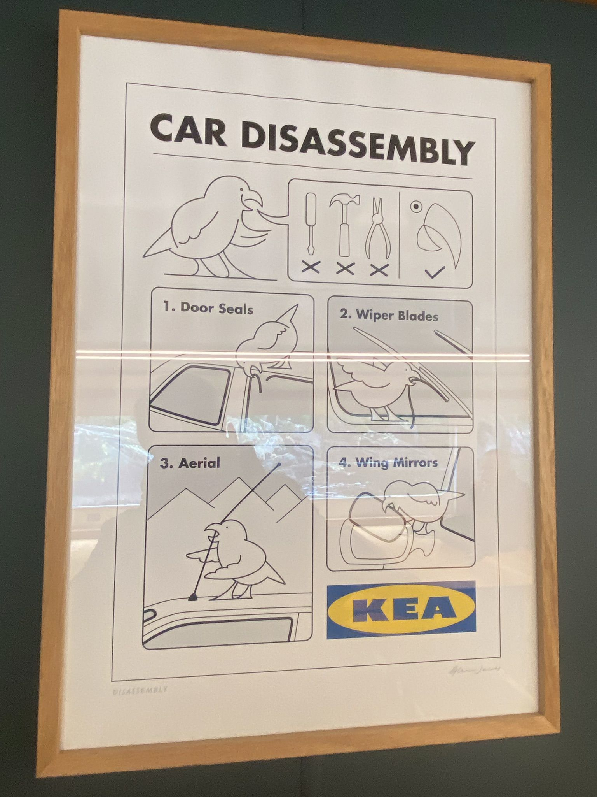

---
aliases:
  - "/holidays/new-zealand-8/"
title: "I visited New Zealand - Part 8"
date: 2025-02-02 15:19:00 +0000
last_modified_at: 2025-04-27 11:49:52 +0000
categories: [holidays]
tags : ["new zealand"]
series: ["New Zealand"]
series_order: 8

summary: "With only one day left on the southern island, we head to an \"unofficial 8^th^ wonder of the world\"."

maps:
  - name: milford-sound
    height: 540
    points:
      - name: Our Hotel
        lat: -45.03347057750902
        lon: 168.66279045647295
      - name: Te Anau
        lat: -45.415663109289234
        lon: 167.71390791621903
      - name: Mirror Lakes
        lat: -45.0283869974136
        lon: 168.01135531496885
      - name: Monkey Creek
        lat: -44.80121626553861
        lon: 168.02149648552077
      - name: Milford Sound
        lat: -44.66817459648156
        lon: 167.9272560624858

milford-coach:
  - image_path: new_zealand_1887.jpeg
    title: "Windows as far as the eye can see"

milford-morning:
  - image_path: new_zealand_1894.jpeg
    title: "Not quite the right misty mountains"
  - image_path: new_zealand_1895.jpeg
    title: "A misty and rainy view out over the bay at Te Anau"

milford-mirror-lakes:
  - image_path: new_zealand_1928.jpeg
    title: "The Earl Mountains reflects off the Mirror Lakes"
  - image_path: new_zealand_1929.jpeg
    title: "Low lying clouds covering the Earl Mountains"
  - image_path: new_zealand_1934.jpeg
    title: "The Earl Mountains reflects off the Mirror Lakes"

milford-monkey-creek:
  - image_path: new_zealand_1955.jpeg
    title: "A Kia wandering along the ground shaking down tourists for food"
  - image_path: new_zealand_1958.jpeg
    title: "A Kia eyeing up a tasty rubber car snack"
  - image_path: new_zealand_1961.jpeg
    title: "Two Kia working in a team"

milford-rainforest:
  - image_path: new_zealand_1018.jpeg
    title: "Frozen winter wonderland before Homer Tunnel"
  - image_path: new_zealand_1977.jpeg
    title: "Tropical Rainforest after Homer Tunnel"

milford-boat:
  - image_path: new_zealand_1997.jpeg
    title: "The magnificent 'Haven'"

milford:
  - image_path: new_zealand_2009.jpeg
    title: &milford_comment "A breathtaking shot of Milford Sound"
  - image_path: new_zealand_2034.jpeg
    title: *milford_comment
  - image_path: new_zealand_2038.jpeg
    title: *milford_comment
  - image_path: new_zealand_2056.jpeg
    title: *milford_comment
  - image_path: new_zealand_1028.jpeg
    title: *milford_comment
  - image_path: new_zealand_2110.jpeg
    title: *milford_comment

milford-waterfalls:
  - image_path: new_zealand_2076.jpeg
    title: "One of the many waterfalls in Milford Sound"
  - image_path: new_zealand_2117.jpeg
    title: "Another of the many waterfalls in Milford Sound"

milford-sunset:
  - image_path: new_zealand_1033.jpeg
    title: "One final sunset to bookend a beautiful day"
---

There was a stroke of 'luck' before we arrived in New Zealand.
On the original booking form for our  tour, the end date was listed as 'Saturday, June 15, 2024'.
However, this turned out to be incorrect, and in all subsequent communications the end date was 'Friday, June 14, 2024'.

By the time we (and the tour company) had noticed this one-day discrepancy, everyone on the tour had already booked all their flights.
We were set to return from Queenstown to Auckland on the Saturday.

This 'extra day' meant that we had to book an additional night at the hotel, and find something to do on the Friday.

In their research for the holiday, my other half had heard that 'Milford Sound / Piopiotahi' was an 'unofficial 8^th^ wonder of the world', so we jumped at the opportunity to use our free day to visit it.

We had waited until we had arrived in New Zealand to ask our tour guide which tour company we should book with.
The answer was an unequivocal '[RealNZ](https://www.realnz.com/en/)'.

## Friday 14^th^: Milford Sound / Piopiotahi



The tour [we chose](https://www.realnz.com/en/experiences/day-cruises/milford-sound-cruises/) was a two-hour boat cruise around the sound, but because Milford is quite remote, the tour also included a coach transfer from Queenstown to Milford, and back (of course).

Just like when we visited the [North Mavora Lakes](#nen-hithoel) two days before, the coach could not travel in a straight line to Milford Sound, and had to travel around the significant mountain ranges that sat between us and our destination.
This meant we had to travel roughly 100 km south, 75 km west, then 117 km north; forming a big 292 km long 'U' shape around the mountains; along the only road that goes there.

This was not going to be a quick journey, adding eight hours of coach travel to a two-hour cruise.
We had a 13:30 appointment with the 'Haven' &mdash; one of the boats operated by RealNZ &mdash; so we had to be at the departure point in Queenstown at 07:15 _sharp_.

It was set to be a long day, with us getting dropped back after 20:00.

### The Coach

Getting to the coach stop at 07:00 was a doddle.
Having our body clocks broken and re-forged by the LoTR tour had turned us from late risers, into early starters; every day had started around 07:00 for the last ten days.

After a quick check in, where I learned that [Scottish Highland Cows](https://www.realnz.com/en/blog/meet-the-locals-the-animals-of-walter-peak-farm/) live in New Zealand too, we jumped on a very fancy coach that seemed custom-built for sightseeing.
Each of the rows of seats sat slightly higher than those in front, so you could see out of the front from any place on the coach.
The roof and walls were mostly glass, allowing us to see in all directions.
It was like riding in a glass bubble.



I appreciated the coach having demisters running its entire length, meaning that the windows stayed clear for most of the journey, even when the temperature dropped outside.

### Breakfast in Te Anau

Our first stop was in Te Anau, which would be about two hours of driving.
The sun didn't rise until around 08:30, so we spent the first hour and a half of the journey in darkness, before watching the sun rise out of the coach window.

I had a long day of pointing and looking at things ahead of me, so I took the opportunity to doze on and off.



The coach pulled into Te Anau, and we parked up outside a shop called 'Kiwi Country'.
It was the standard tourist shop that sold keepsakes and shirts with slogans like 'Keep Calm and Kiwi', alongside offering toilets to weary travellers.

The bus driver recommended [Miles Better Pies](http://www.milesbetterpies.co.nz/) for breakfast, which was about a five-minute walk through town.
The pies were worth the walk, and constituted a hearty breakfast that would see us through to lunch.

Back on the coach, bellies full, we headed north.

### Eglinton Flats & Mirror Lakes

There was a bit of buffer time built into our morning schedule.
We had just over six hours to get to Milford Sound, and according to Google Maps, it is only four hours of driving to get there.

As nothing had gone wrong so far (like losing someone in the toilets at Te Anau), and they didn't want us arriving at the boats too early, we were told by the driver we had time to do some sightseeing.

As an aside, I have a huge amount of respect for our driver.
Not only was he driving a huge coach on unforgiving roads, but he was wearing a headset and being an engaging tour guide as well.
During the journey, he gave us frequent details and stories on the areas we passed through.

Our next stop was Eglinton Flats; an area carved out by Glaciers thousands of years ago.
The area was stunning, but it was not my lingering memory of the area.

When we stopped, the coach driver told us we could not use drones because the wind would claim them as its own.
This was accented by a giant 'No Drones' sign as we got off the coach.
Even then, as we left the coach, multiple people immediately launched drones into the sky.
It felt like one of those 'the sign should have been in multiple languages' moments, but I did have a good chuckle.

<!-- markdownlint-disable MD033 -->
<iframe
    markdown="0"
    src="https://www.google.com/maps/embed?pb=!4v1737407392876!6m8!1m7!1sgbngmuK9XSTIqAy8bMA3Ug!2m2!1d-45.06182995282183!2d167.9949241338097!3f5.7412880641415285!4f-2.241075672227865!5f3.325193203789971"
    width="100%"
    height="450"
    style="border:0;"
    allowfullscreen=""
    loading="lazy"
    referrerpolicy="no-referrer-when-downgrade">
</iframe>
<!-- markdownlint-enable MD033 -->

After about fifteen minutes at the flats, we hopped 5 km north, to an area called the 'Mirror Lakes'.

We disembarked and strolled along a purpose built walkway which hung over the edge of the lake.
It was easy to see how the lakes got their name, as the Earl Mountains reflected off of the perfectly smooth surface of the water.
Even though we were surrounded by about a hundred tourists, it felt eerily tranquil.



We had to take it all in quickly however, because just as soon as we had got down to the lake, we had to head back up to the coach, to get back on the road.

### Monkey Creek

As we travelled north once more, our tour guide ramped up his explanations of the local area, its history, and its wildlife.

We learned of the [Kia](https://en.wikipedia.org/wiki/Kea), a bird native to New Zealand with the intelligence of a small child.
Able to solve puzzles, they have been known to drag traffic cones into roads, stopping cars, then hassling the occupants for food.

They were well known for being destructive, having a particular soft spot for the rubber parts of cars.

The birds were common in an area we were passing through called 'Monkey Creek'.
As we pulled into the lay-by as disembarked, we were treated to about five of the birds, some wandering around accosting tourists, and others standing on car roofs.



As if on cue, one of the Kia nibbled at the rubber seal on a parked car; the occupants were none too happy and tried to drive off.
This unfortunately did not phase the Kia, and it continued picking at the rubber as the car disappeared off into the distance.

I did capture a video of a Kia, which has to be the best home video I will ever take.
You can see the picture of the Kia above the coach tyre &mdash; which made sense now &mdash; then I pan up to one, who chirps on cue.



I await my Golden Globe.

The Kia reminded me of [Longleat Safari Park](https://www.longleat.co.uk/safari), where the monkeys are nationally famous for pulling off parts of your car.

A touch out of order, but later on the boat we saw a 'Car Disassembly' guide, in the art style of an IKEA manual, which I had to giggle at.

{style="width: 50%;"}

### Homer Tunnel

Back on the coach, making sure the cheeky Kia had not stolen our belongings, we continued on.
We had about an hour until we had to be at the dock, so there was time for one more stop.

First, however, we had to head through [Homer Tunnel](https://en.wikipedia.org/wiki/Homer_Tunnel).

Now I love a tunnel.
I enjoyed going through them as a kid, and I have no intention of stopping enjoying them as an adult.
There's something about the marvel of engineering it takes to carve a hole in the ground that appeals to me.

Homer Tunnel was something else.
There were two key reasons transiting through this tunnel blew me away.

The first is that it's over a kilometre in length, through solid granite, with a steep downwards gradient.
The sides and roof to the tunnel are still unfinished, so you can still see the rock face.
It felt like we were descending so deep we might see a Balrog.

The second is that on the eastern side, we entered from a frozen winter tundra.
Snow covered mountains all around us, flakes falling from the sky; a real winter wonderland.
However, emerging from the west 'portal' we found ourselves in a tropical rainforest.
The tour guide even played the theme song from Jurassic Park (which didn't have the full effect because the windows fogged up).



I didn't capture a video of it myself because I had no idea it would be so breathtaking[^1].
So here is one from 'JoyRide Australia' that shows what we saw.



[^1]: I found out when writing this blog that transport to Milford is a hot topic.
      So much so that it has its own [Wikipedia page](https://en.wikipedia.org/wiki/Transport_in_Milford_Sound).

After the tunnel, we stopped to wander into the forest for half an hour, trying to kill time before the scheduled departure time of our boat.
We got to see a pretty sweet waterfall, nothing compared to the waterfalls we were about to see, but cool regardless.

### The Boat

Unlike our thematic arrival into Hobbiton a [week earlier](#hobbiton) &mdash; where we passed over the summit of the hill, seeing Hobbiton laid out before us &mdash; the approach to Milford Sound was fairly subdued.
The road leading towards the sound was surrounded by trees, so we couldn't see much, until we happened upon the coach parking.

Even from the docks, we could only see a sneak-peek of what was to come, as most of the boats were lined up, ready to depart.
Ours, the magnificent 'Haven', already had a significant queue forming dockside, and we were a touch concerned that we would 'not get a good seat'.

In retrospect, that concern was not warranted, for reasons that will become clear.



The Haven consisted of two 'inside' decks, where you could sit down and look out at the scenery from relative comfort, and a rooftop 'garden'[^2] with 360 views of anything we sailed past.
The lower deck had a café and bathrooms, which was good because it was a two-hour cruise; a side of chips would go down well at some point.

[^2]: The 'garden' was fake grass, but I don't think I could expect more from a boat.

We rushed in to 'claim' a table and seating, but after a minute of looking out of the window, I decided I wanted to experience the sound 1^st^ hand.
It dawned on me that we had spent nine days watching New Zealand pass through the window of a coach, it would be nice to feel the wind (and rain) on my face for a bit; so I headed up to the top deck.

It is not often you find yourself in one of the most beautiful places in the world, looking back I think it was the right call to experience it with all my senses.

If you do find yourself going, I would recommend a wind-proof jacket, a hat, some gloves, and maybe a scarf.



The views were outstanding; these pictures _do not_ do it justice.
It was not hard to see why they are in the list of "unofficial 8^th^ wonders of the world".
You could not look in any direction without seeing something beautiful.

During the two-hour tour, a guide on the boat told us about the things we were sailing past, like tree avalanches.
The sides of the mountains in the sound consist of the occasional 'anchor tree' &mdash; a tree that has roots into the side of the mountain &mdash; supporting lots of lichen, moss, and other smaller trees.
When one of these anchor trees reaches the end of its life, it falls from the mountain, causing all the life suspended from it to fall too.
This creates an interesting looking bare strip on the side of the mountain.

I didn't get a picture of one in the sound because I was too busy taking it all in, so here is a picture of one we saw earlier in the day:

{style="width: 50%;"}

Throughout the sound you can see lots of these strips in various stages, because once the avalanche happens, the whole cycle of life begins anew.
It's not bare for long.

Other sights included pods of dolphins, and many, many waterfalls.
Luckily, it had rained the day before, so all the mountain waterfalls were at their best.



I have no photos of the extreme end of the tour, where we sailed a big arc around Dale Point &mdash; where the sound meets the Tasman Sea &mdash; because I was too afraid to lose my phone.
We were warned by the guide that, as we headed out towards the ocean, that it would get windy.
In preparation, I secured all my belongings, making sure nothing would make a quick exit from the boat.
I did forget to secure myself as rigorously, and I was almost blown off my feet several times.

On the way back, our captain actually took the nose of the boat under one of the waterfalls.
My other half jumped at the opportunity to get a [cool photo](new_zealand_2076.jpeg).
Apparently it is considered good luck to be splashed by its water, however it looked like all my other half got was wet.

After that, we did head inside and get a snack from the café (and to dry off).

### The Journey Home

Back on dry land, we got back into the coach, and headed back to Queenstown.

Our tour guide stayed mostly quiet, giving us time to reflect, relax, and doze if we wanted to.
I don't remember much beyond the amazing sunset that book ended a beautiful day.



By the time we got back it was dark, our last night in the hotel, and our last night on the southern island.
Too tired to go out and grab food, we got some from the hotel bar.

I know, I know, we missed an opportunity to experience another restaurant and/or bar, but we were too tired and feared we wouldn't appreciate it.
We will just have to go back, I guess. :wink:

★★★★★ 5/5 - If you have a _whole_ day free, this tour is a must.
Given you cannot escape how long it takes to get there, the coach journey was comfortable, and educational.
We got to see a completely different ecosystem that felt more like a rainforest than wintry southern New Zealand.
The cruise was smashing, after so many days travelling in coaches, it was nice to feel the wind in my hair.
Zero regrets.

## Saturday 15^th^: Auckland Encore

Tomorrow we fly back up to Auckland, leaving the frozen vistas of the south behind us for one final night in New Zealand.

Kia Ora!
See you in [part 9]()!
