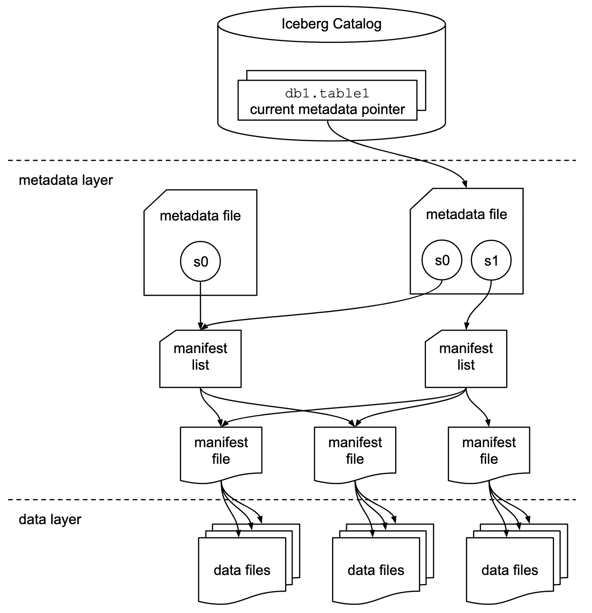

---
aliases:
  - "/code/long-live-the-lakehouse/"
title: "Long Live The Lakehouse"
date: 2025-06-15 10:50:00 +0100
categories: [code]
tags: [data, architecture]
---

I finally feel like the industry is ready to support 'the [Lakehouse](https://www.databricks.com/glossary/data-lakehouse)'.
I thought I would write about how Apache Iceberg is making it possible.

<!--more-->

## The Problem

In many organizations, you will have a multitude of data sets floating around the business.
They may be your core business (as in, you sell data), or you might just leverage data to provide a service.
This data may come from outside the company, or from within, being manually input by members of staff.
But regardless of the origin or volume of the data, it needs to be readily available for use inside the business.

Many fantastic data tools now exist on the market, offering a broad (and often overlapping) set of features.
Hosted platforms like [Azure OneLake](https://learn.microsoft.com/en-us/fabric/onelake/onelake-overview),
[Snowflake](https://www.snowflake.com/en/), and [Databricks](https://www.databricks.com/),
or locally run tools like [Jupyter](https://jupyter.org/), allow Data Scientists and Engineers to set up  pipelines;
generating new datasets and data points.

You could just pick one, say Databricks.
You could place all of your data in a Databricks account, and leverage the platform to its fullest.

But what if you already have a lot of data in your business?
Like many businesses, your data is probably stored in the cloud (likely in  S3[^1]), because it is cheap long-term storage.
Copy and pasting all of it into a new platform will be particularly onerous and costly.

[^1]: S3 is so commonly used an outage in it [took down half the internet](https://www.datacenterknowledge.com/outages/aws-outage-that-broke-the-internet-caused-by-mistyped-command).

If you're sensible, you will want to keep your data 'under your control', just in case you and your chosen platform have a messy break up.
Now you have to keep two copies of everything[^2].

[^2]: And your backups? Right? RIGHT?!

But most importantly, what if you want to be able to use the features of more than one platform at the same time?
You want to use [MLflow](https://docs.databricks.com/aws/en/mlflow) in Databricks, but you also want to use the
[data sharing](https://docs.snowflake.com/en/user-guide/data-sharing-intro) feature of Snowflake?

In 2023, tools like [ChatGPT](https://en.wikipedia.org/wiki/ChatGPT) took the industry by storm.
We can't predict what the next 'must have' tool will be, but we know our data should be usable in it.

Importantly, when I say _use_, I mean each tool can not only read, but also **write** data.
An ETL pipeline is not much use if the result is not available elsewhere.

One pipeline should be able to read a dataset authored in Databricks, from Snowflake, then use that data to write a new dataset that a pipeline in Azure could use.

I have seen referred to as '**CORE**': Create Once, Read Everywhere[^3].
Create a data point only once, and then surface that data, where it is needed, from the location you stored it in.

[^3]: I have also seen COPE (Create Once, Publish Everywhere), but that seems more related to web publication.

What did they say when we were younger?
If it sounds too good to be true, it is.
What mythical tooling could make the rows in my AWS stored datasets, available to read (and write) in Databricks, Snowflake, or Azure?

Well, I would say in 2025, the data ecosystem now has a solution in the form of 'Open Table Formats';
specifically [Apache Iceberg](https://en.wikipedia.org/wiki/Apache_Iceberg)[^4].

[^4]: Now I've said it, Delta Tables will become the industry standard.

## Open Table Formats

File formats like [Apache Parquet](https://en.wikipedia.org/wiki/Apache_Parquet) store data optimally to allow efficient queries over a single file of data.

But what can you do when you have hundreds of thousands of files?
That's where an 'Open Table Format' (OTF) comes in.

This adds a metadata layer over the top of all of your files that allows for efficient query of the data.

OTFs also allow for schema evolution (through witchcraft) and  queries (Inserts/Update/Deletes) across multiple files.
All the good stuff that any database can offer.
[StartDataEngineering](https://www.startdataengineering.com/post/what_why_table_format/) have a great blog on Open Data Tables that is well worth a read.

The key part, however, is the _open_ part of the .

For a long time I have loved and used PostgreSQL, which is an amazing database.
Unfortunately, PostgreSQL stores its data in a bespoke on-disk file [format](https://www.postgresql.org/docs/current/storage-file-layout.html) that is not usable by other tools, so anything stored in PostgreSQL, can only be accessed through a running instance.
If PostgreSQL couldn't be run for some reason, you lose the data.

The tables stored in an OTF however, are usable by other tools.
I am able to store my data on a storage engine (like AWS S3), augment it with an OTF, and then select the tool of my choice that supports that OTF.

I can expose that OTF table in the ecosystems where the best tooling exists, helping me achieve the  principle.

## Fragmentation

Or does it?

I can only be CORE **IF** the ecosystems I want to use, choose to support it.
If I select an OTF and a company like Snowflake or Databricks choose to ignore it[^5], then I am stuck either not using that company, or copy and pasting my data in and out of their solution.

[^5]: [Hudi](https://hudi.apache.org/), anyone?

Up until the start of 2025, Snowflake was team Apache Iceberg, and Databricks were team Delta lake.
Each provider exclusively supporting only their own open table standard.
Which kind of defeats the point, right?

If the two biggest hitters in the data platform as a service can't agree on the same open table format, we haven't solved anything.
Tools like [Apache XTable](https://xtable.apache.org/) sought to put a plaster over the issue, by allowing conversion between them.
But this adds quite a bit of complexity.
Wouldn't it be nicer if they all used one OTF?

Luckily, at the start of the year, it seems like everyone is adopting Apache Iceberg.
Tools like Google Cloud [BigQuery](https://cloud.google.com/bigquery/docs/iceberg-tables), Azure [Data Factory](https://learn.microsoft.com/en-us/azure/data-factory/format-iceberg), AWS [S3](https://aws.amazon.com/about-aws/whats-new/2024/12/amazon-s3-tables-apache-iceberg-tables-analytics-workloads/), and [Snowflake](https://docs.snowflake.com/en/user-guide/tables-iceberg), all support Iceberg out-of-the-box.

Fantastic!

## Owning the Metadata

Unfortunately support for an OTF is not enough.

Remember the metadata layer that the OTF brings to the table?
Well someone needs to be the owner of the process which updates the metadata;
otherwise known as the 'Catalog'.

When writing a row to an Iceberg table, you are actually sending a request to a Catalog , which appends data to the underlying table.
Then on the next read of the table, the new row appears.

You can't have multiple Catalogs owning the metadata, otherwise you would get some lovely conflicting opinions on what the table should contain.

Why is this a problem?

As an example, in early 2025 Snowflake would only let you _read_ from an external Catalog &mdash; a Catalog not controlled by Snowflake &mdash; but not write to one.
This meant that if you were storing your data in an AWS Glue Catalog, you could read that data in Snowflake, but you couldn't write to it.

Fine, fine, I'll just let Snowflake manage the Catalog then.

Well, now you can't read or write from that table in Redshift, because it only supports the AWS Glue Catalog.
Picking one table owner, closed some doors, while picking another closed others.
It was all a horrible game of snakes and ladders.
Depending on the current tools in your architecture, there was often no good solution.

## The Future is Bright

Thankfully, platforms like Snowflake are now supporting [writing](https://docs.snowflake.com/en/release-notes/2025/9_08#iceberg-tm-tables-row-level-deletes-for-externally-managed-tables-preview) to external Catalogs.
Allowing a shift towards a more unified ecosystem.

[Databricks](https://docs.databricks.com/aws/en/query-federation/foreign-catalogs) and [AWS](https://docs.aws.amazon.com/lake-formation/latest/dg/federated-catalog-data-connection.html), haven't quite got there yet, but I expect given the push toward interoperability, they will support it soon.

These platforms do have a vested interest in locking you into their ecosystem, so I'm hoping that enough businesses who want flexibility push them towards implementing (and keeping) this support for OTFs.

It's not really manageable for a company to copy all their data into each data platform as a service (trust me, I've tried);
or, to set up replication of datasets back and forth.
Simple tasks, like adding a column, can break all the clever ETLs you have written.
It's much more maintainable to have a single Catalog managing your whole Lakehouse.

My fingers are crossed that [Apache Polaris](https://polaris.apache.org/) takes off.

## Wrap me in a Data Fabric?

All of this might be redundant soon if the next layer of abstraction gains traction.

[Data Fabrics](https://developer.ibm.com/articles/introduction-to-data-fabric/) look to hide away all the different data sources that companies have, and provide a single API layer.
One place to manage access, Governance, and data definitions.

Data Fabrics would mean you can leverage a lot of useful tooling, without having to migrate out of the fifteen database technologies scattered across your architecture.

Data Fabrics like [cube.dev](https://cube.dev/docs/product/caching/recipes/joining-multiple-data-sources) promise to be able to join data from multiple data sources.
How will this perform?
It's going to be an interesting space to watch.

## Fin

Thanks for reading!
