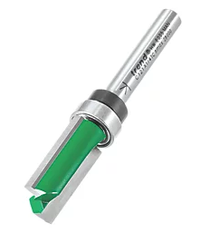
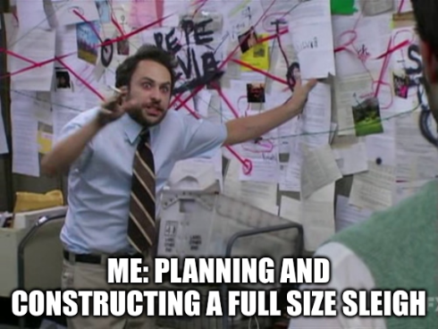
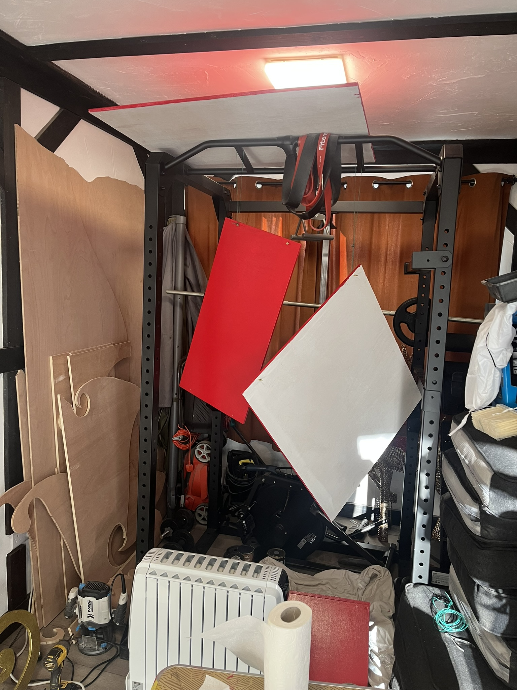
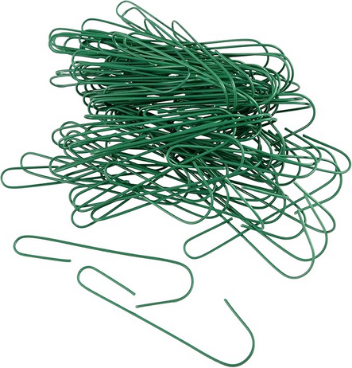

For some insane reason, I decided to build a 'full size' Santa Sleigh for Christmas.

<!--more-->

## Background

In early November, I was browsing [UK Christmas World](https://www.ukchristmasworld.com/)'s website, looking for some new Christmas decorations for our front lawn.
Putting on a great Christmas display has become a bit of a tradition for us over the last few years, and I was looking for something that could take us to the next level.



I stumbled across a full sized Santa Sleigh.
Now I wasn't going to pay the £2,739 they were asking for it, but it did look really cool.



Something about that sleigh got me thinking.

> I could probably build that myself.
>
> &mdash; Phillip Whittlesea-Clark - 2025

How hard could it really be?

## The Design

So I started looking for designs online.
Someone surely had built a sleigh before, and uploaded the design files for others to use.

Well, luckily for me, someone had.
Jay Bates from Jays Custom Creations was the legend in question.

He had uploaded the [original designs](https://github.com/MaslowCommunityGarden/Santa-Sleigh/tree/master), created a [blog post](https://jayscustomcreations.com/2020/12/full-size-santa-sleigh-free-files/) about the build, and even made a [YouTube video](https://www.youtube.com/watch?v=NaBIX9frEB0) showing the entire process.



Before I go any further, I want to give a huge shout out to Jay Bates for sharing his design and process with the world.

Looking at the design, I could see that it was going to probably cost me a few hundred pounds in materials, but that was still way less than buying a pre-made sleigh.
At this point, I was all in, so I downloaded the SVG files and ordered the initial materials.

## Step by Step

Here is a step-by-step breakdown of how we built the sleigh.
It's not a perfect guide, but it should give you an idea of the process we went through.

### Step 0: Setup

Before we start, here is a list of the materials and tools I used throughout the build.

#### Materials

| Material                     | Quantity            | Cost     |
|:-----------------------------|:--------------------|---------:|
| Cardboard                    | 1 A4-ish Cereal Box | £0       |
| 9 mm Plywood 2440 x 1220 mm  | 2 sheets            | £48      |
| 12 mm Plywood 2440 x 1220 mm | 3 sheets            | £72      |
| Wood Glue                    | 1 bottle            | £9       |
| Masking Tape                 | 1 roll              | £5       |
| Wood Primer & undercoat      | 1.5 l               | £28      |
| Exterior Red Gloss Paint     | 1.5 l               | £56      |
| Exterior Yellow Gloss Paint  | 750 ml              | £15      |
| Glitter Gold Paint           | 750 ml              | £36      |
| 5 mm x 30 mm Screws          | 28                  | £2       |
| 5 mm x 40 mm Screws          | 12                  | £1       |
| **Total**                    |                     | **£272** |

#### Tools

- Scalpel and/or Stanley Knife &mdash; for cutting the cardboard template
- Pencil / Pen &mdash; for tracing the design
- Router &mdash; for cutting the plywood
- For cutting around the template &mdash; a router bit with a bearing on the top
- Detail / 'Mouse' Sander &mdash; for sanding the plywood
- Trestles &mdash; for supporting the plywood while cutting (which I don't have)
- Drill &mdash; for drilling the holes and driving the screws
- Paint Brushes &mdash; for painting the sleigh

### Step 1: Creating a Template

The original instructions started off by cutting all the wood using a CNC machine.
But I don't have a CNC machine, so I had to improvise the transfer of the provided SVG design onto the plywood.

My desire was to cut out a template on an A4 piece of paper and then use a light to cast a shadow onto the plywood. I could then trace the outline of the shadow with a pencil.

This shadow approach worked better than I expected, but still had its flaws.
I needed a very bright and directed light source to cast a clear shadow.

With every torch I owned, some parts were quite clear, and some parts were very blurry, as the torch either contained multiple LEDs or had a lens to cast a wide beam.
Luckily an iPhone torch has a very bright, single LED, which casts a very directed beam of light.



Three clamps, a wire hanger, a monitor arm, zip ties, a swivel phone mount that came with my electric toothbrush (for some reason), and one iPhone later, we had a convoluted enough setup to cast a shadow of the sleigh onto the plywood.

This worked well enough for me to get a rough outline of the sleigh onto the plywood, which we could then refine before cutting.



We spent quite a bit of time 'fixing it in post'; reshaping the ends of the sleigh &mdash; where the shadow was distorted the most &mdash; making sure the round parts were sufficiently round, and the straight parts were sufficiently straight.

{style="width:50%;" class="items-center mx-auto"}

### Step 2: Cutting the Sides

What a boy would give for a CNC machine...

I used a router (which I had to buy) to cut out the first side of the sleigh.
If this had gone well, I planned to use this as a template to cut the second side.
If this went badly, then I had bought one extra sheet of the 12 mm plywood just in case.



Thankfully, it went reasonably well.
I would give myself a 6/10.

Sure, I cut into the camping table I was using as a makeshift workbench a few times, but I mostly kept to the lines.
There were a few places that required some significant sanding to hide my inexperience, but on the whole, it was a good first effort.

Once sanded, I clamped this first side down to the second sheet of plywood and used it as a template to cut the second side.



This needed a special router bit with a bearing on the top, to ensure the router followed the profile of the first cut.

{style="width:25%;" class="items-center mx-auto"}

Attaching my vacuum cleaner to the 'dust collection port' of the router did _literally_ nothing.
Just as much dust went into every corner of the room as it would have done without it.

### Step 3: The Trim

The original design has a thin trim running around the main body of the sleigh.

We wanted to replicate this as it gives a nice depth that separates the main body from the runners.
Plus we can paint it gold which will look great.

We replicated the same process of cutting the main body of the sleigh to get the outline of the trim.
Then I used a 'freehand' process, using the router to cut the inside of the trim.

Once we had done one side, we used it as the template for the other side[^1].

[^1]: I completely forgot to take pictures of this process, so you'll have to use your imagination.



I was reminded that I own too few clamps as we glued the trim to the main body of the sleigh.

### Step 4: The Interior

The next milestone was to cut the interior pieces of the sleigh.
The front, back, floor, and seat.

Luckily, that spare sheet of plywood I bought was still intact, so we could use it instead of having to buy another one.

Holding the two sides of the sleigh apart gave us a desired width of 800 mm.
Because we had projected the original design onto the plywood, we could no longer rely on the measurements provided in the design.

Ours was set to take on a life of its own, and we had to embrace that.



The next problem was how we were going to attach all these parts together.

In the original design (as shown in the YouTube video), the sides of the sleigh were connected to the interior pieces using barrel bolts.
This was possible as the wood used was 18 mm plywood, which is thick enough to drill a hole for the barrel bolt to sit in.

Unfortunately, we were using 12 mm plywood, which is not thick enough to do this, so I had to come up with a different solution.

I cut some 24 mm wide strips of the 12 mm plywood and glued them into pairs.
I cut each of these pairs into 100 mm lengths, giving me 'blocks' that I could use to connect the sides to the interior.



What's the phrase?
"If it looks stupid, but it works, it ain't stupid."

Each block was screwed into place with two screws from the outside of the sleigh.
This will 'ruin' the look of the outside of the sleigh, but I'll deal with it.

It was at this point I elected to leave the installation of the seat until after we had painted and assembled the rest of the sleigh.
This was mostly because the seat needed to look flush with the main body of the sleigh, and I didn't trust myself to get that right.

We very briefly assembled the sleigh to see how it was coming along, and promptly decided that we are, indeed, mad.

{style="width:50%;" class="items-center mx-auto"}

### Step 5: Painting

Now, we could have just assembled the sleigh and dumped it on the front lawn, but that wouldn't have been very Christmassy, would it?

So we set about painting the sleigh.
The sleigh is going to be outside in a British winter, so I wanted to make sure it was suitably protected from the elements.

A long time ago someone much wiser than me said:

> You can't paint your way out of a lack of preparation.
>
> Do the hard work, and the painting will be easy.

So, I touched up a couple of areas with some wood filler and then sanded down any final areas that needed some TLC.
Then, we set about getting two coats of primer on the sleigh.



The primer was pretty easy to apply, but the hard work was yet to come.

We couldn't find 'gold' paint which was also suitable for outdoor use, so we needed to paint the trim and skis yellow, then paint over that with glitter gold paint.
This was going to increase the time waiting between coats significantly.
We needed two coats of yellow, each needing an hour to dry, and then four coats of glitter gold, each also needing two hours to dry.



I wish I had a larger space to paint in, as I could only paint one side at a time, and I couldn't begin painting any of the red until the gold was fully dry.

However, after what felt like an eternity, we finally got to the red paint.
This was 'front door' paint.
Thick, glossy, and designed to get everywhere it possibly could.



The red only needed two coats, each needing about three hours to dry.
There were far more red bits to paint, as the interior pieces were all red as well, so I resorted to hanging red pieces of plywood from my [Power Rack](https://en.wikipedia.org/wiki/Power_rack) to dry.
Who knew that a power rack could double as a drying rack?

{style="width:50%;" class="items-center mx-auto"}

Add 'spray-painting booth' to my ever-growing list of things which would have made this project easier.

Once all the paint was done, we were in the 'my god we built a sleigh' phase of the project.
It was all coming together.

### Step 6: The Assembly

Now it was time to put everything together.

This whole project has been an exercise in 'doing a thing in a space four times smaller than ideal', so assembling the sleigh was going to be no different.

The only indoor space that had a door wide enough for the final product was the Kitchen.



Holding the parts in place was a two-person job, but the wooden blocks made it reasonably straightforward to screw everything together.

The seat, which I had earlier declined to drill the holes for until after painting, was now a simple matter of placing it in the sleigh, using masking tape to record its position, drilling the holes, and screwing it in place.

It was only held in place by two screws through the base of the sleigh, up into the wooden blocks on the back of the seat, but it felt solid enough.
The sleigh wasn't going to be used to carry people.

### Step 7: The Final Touches

You can't put a sleigh out for Christmas without some lights.
I stapled some green wire decoration hooks to the rim of the sleigh, which were twisted around the lights to hold them in place[^2].

[^2]: I use these wires _everywhere_ at Christmas time. They are super useful.

{style="width:25%;" class="items-center mx-auto"}

The lights we had spare had a lit length of about 45 metres, which was more than enough to go around the body of the sleigh once, with plenty left over to drape inside the sleigh.



## The Result

The result is fantastic, if I do say so myself.
The overall look of the final product is a little rough around the edges, but as part of this year's Christmas display, it looks great.



When comparing it against the original design which we started from, there are some noticeable differences.

Given our limited tools, space, and experience, I think we did a damn fine job.



{style="width:50%;" class="items-center mx-auto"}

Cheers Obama.

## Lessons Learned

Retrospective time!

Looking back, what would I do differently?

1. Drill the seat holes before painting the sleigh.
2. Paint the sides of the sleigh red first, gold second - because the masking tape ripped off the gold.
3. Glue the trim on after painting the main body - reduce the amount of masking I had to do.
4. Drill all the holes at an outward angle - so the drill could be more easily positioned during assembly.
5. Start earlier in the year to give myself more time - we were still painting on the morning of December 1^st^!
6. Buy some more clamps - you can never have too many clamps.
7. Buy Trestles - the camping table I was using was not ideal, and did not survive the project.
8. Get a shop vacuum - my vacuum cleaner was not up to the task of collecting all the dust.

## Conclusion

This was an ambitious project, but one that I am super happy to have completed.
I've spent most of my adult life writing code, so it was nice to do something physical for a change.
Annoyingly you cannot run 'Ctrl+Z' to undo mistakes in the real world.

If I were a betting man, I would have said there was no way we would have finished it.
But we did, and it looks great.

Thanks for sticking around and reading.

Merry Christmas! :christmas_tree:
